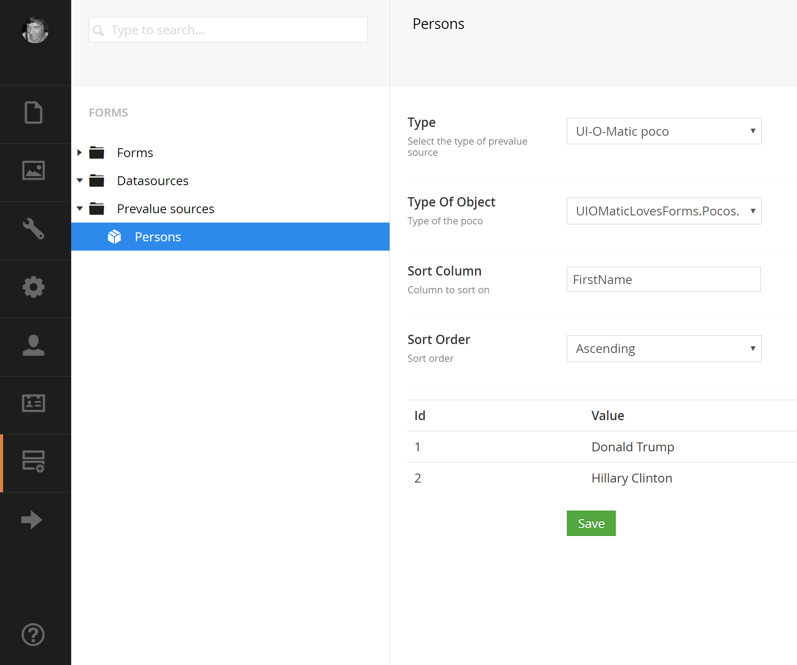

# UIOMatic-Loves-Forms
Addons for [Umbraco Forms](https://umbraco.com/products-and-support/forms/) that connects your [UI-O-Matic](https://github.com/TimGeyssens/UIOMatic) pocos

Currently only contains a new prevalue source type that allows you to hook an UI-O-Matic Poco to your Form fields

