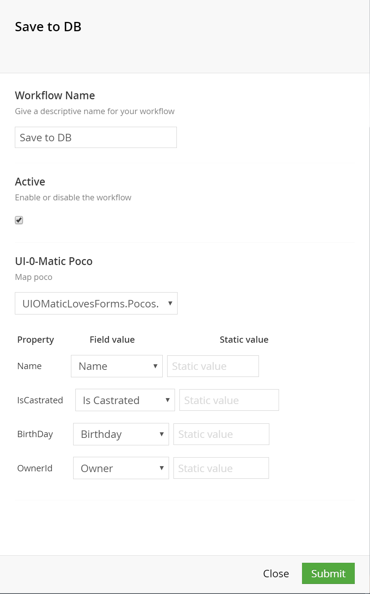
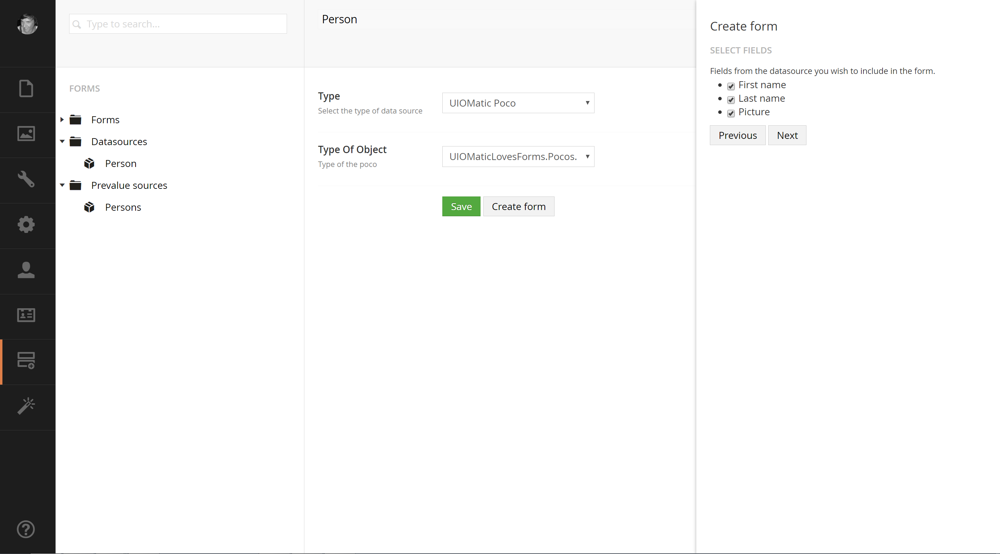

# UIOMatic-Loves-Forms
Addons for [Umbraco Forms](https://umbraco.com/products-and-support/forms/) that connects your [UI-O-Matic](https://github.com/TimGeyssens/UIOMatic) pocos

Currently contains the following

## Workflow type ##
Allows you to setup a workflow that will map a Umbraco Forms record agains a UI-O-Matic poco. So save a recod to a custom db table.

## Prevalue source type ##

Allows you to connect a UI-O-Matic poco to your list Umbraco Form fields (dropdownlist, checkboxlist, radiobuttonlist). So populate those controls from the db

## Data source type ##

Allows you to generate a form based on a UI-O-Matic Poco.

